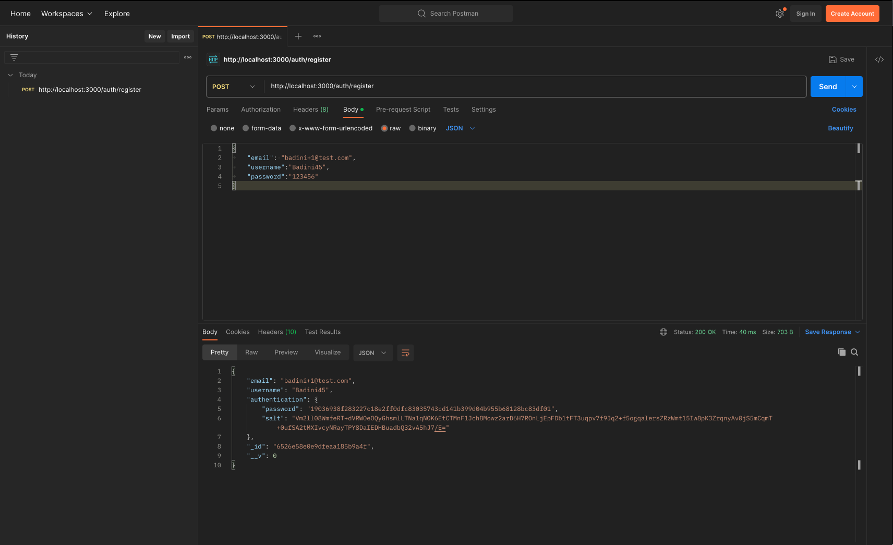
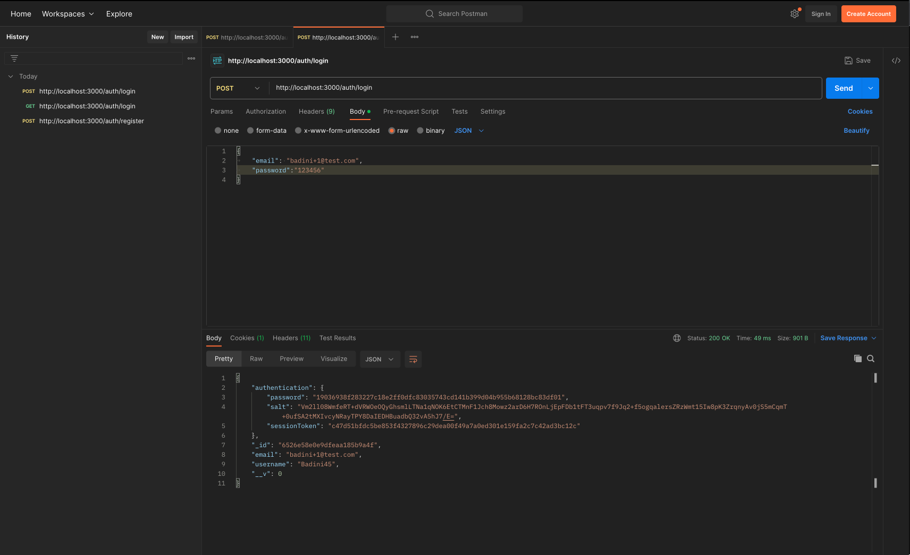
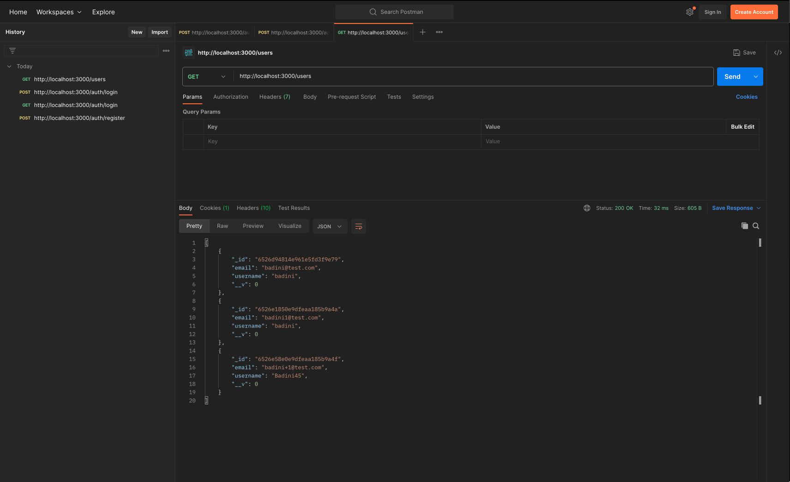

## REST API With Node, Express, TypeScript & MongoDB + Authentication
This is a repository to Building A REST API With Node, Express, TypeScript & MongoDB + Authentication


## About this Repository


## Technologies
- Node js
- MongoDB
- Express
  
## 🔐 Setup .env file
MONGO_URL

# Screenshot




## :running: Run Locally

Clone the project

```bash
  git https://github.com/badiniibrahim/node-auth-api.git
```

Install dependencies
```bash
  yarn install
```

## Getting Started

Start the server
First, run the development server:

```bash
  yarn start
```
